# 0. Simple Web Stack

A simple one-server web infrastructure that hosts a website accessible at **www.foobar.com**.

---

## 🌐 Diagram – Flowchart

```mermaid
flowchart LR
    U["Utilisateur Navigateur"] -->|1.1 Requête DNS: www.foobar.com| DNS["DNS récursif"]
    DNS -->|1.2 Réponse: A=8.8.8.8| U
    U -->|1.3 HTTP/HTTPS vers 8.8.8.8| NGINX["Nginx (serveur web)"]

    subgraph S["Serveur 8.8.8.8"]
        NGINX -->|Proxy / FastCGI / uWSGI| APP["Serveur applicatif (code)"]
        APP -->|SQL| DB[("MySQL - Base de données")]
        NGINX -. fichiers statiques .-> FS["Fichiers applicatifs (HTML/CSS/JS, assets)"]
    end

    DB --- noteDB["Stocke les données (utilisateurs, contenus, etc.)"]

```

```mermaid
sequenceDiagram
    participant User as Utilisateur (Navigateur)
    participant DNS as DNS
    participant Nginx as Nginx (Web)
    participant App as Serveur applicatif
    participant DB as MySQL

    User->>DNS: 1.1 Résolution DNS (www.foobar.com)
    DNS-->>User: 1.2 IP = 8.8.8.8 (A record)
    User->>Nginx: 1.3 HTTP/HTTPS GET /
    Nginx->>Nginx: Vérifie fichier statique ?
    alt Fichier statique
        Nginx-->>User: 200 OK (asset)
    else Contenu dynamique
        Nginx->>App: Transfert requête (proxy)
        App->>DB: Requête SQL
        DB-->>App: Résultats
        App-->>Nginx: Réponse HTML/JSON
        Nginx-->>User: 200 OK (page)
    end
```

---

## 📄 Explanation

### 1) User Request and DNS Resolution
1. **The user opens a browser** and types `www.foobar.com`.
2. **The browser asks the DNS** to resolve the domain name into an IP address (A record).
3. **The DNS replies** with the IP address `8.8.8.8`.
4. **The browser sends an HTTP/HTTPS request** to the server at `8.8.8.8`.

---

### 2) Server-side Flow
1. **The web server (Nginx)** receives the HTTP request.
   - If the request is for a static file (HTML, CSS, JS, image), Nginx serves it directly.
   - If the request needs dynamic content, Nginx forwards it to the application server.

2. **The application server** runs the codebase (backend logic) to generate a response.
   - If data is needed, it queries the **MySQL database**.
   - The database returns the requested data to the application server.

3. **The application server sends the response** (HTML, JSON, etc.) back to Nginx.
4. **Nginx sends the final response** back to the user’s browser.

---

### 3) Components and Their Roles
- **Server:** A physical or virtual computer that hosts the website and responds to user requests.
- **Domain name (`foobar.com`):** A human-readable address that maps to the server’s IP.
- **DNS Record:** `www` is an **A record** that maps the name `www.foobar.com` to `8.8.8.8`.
- **Web server (Nginx):** Handles HTTP/HTTPS requests, serves static files, and forwards dynamic requests to the application server.
- **Application server:** Runs the application code (business logic) and prepares dynamic responses.
- **Application files (codebase):** The actual code of the website (front-end + back-end).
- **Database (MySQL):** Stores and retrieves data used by the application.
- **Protocol:** The server communicates with the user using HTTP or HTTPS.

---

### 4) Infrastructure Issues
- **Single Point of Failure (SPOF):** If the server goes down, the whole website is unavailable.
- **Downtime during maintenance:** Deploying new code or restarting Nginx causes temporary downtime.
- **Scalability issue:** This setup cannot handle heavy traffic — one server may become overloaded.

