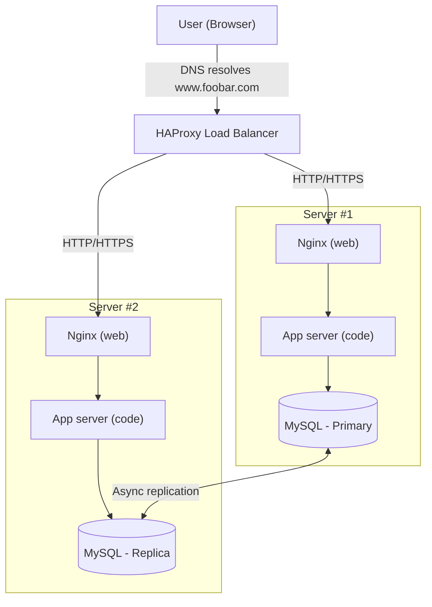
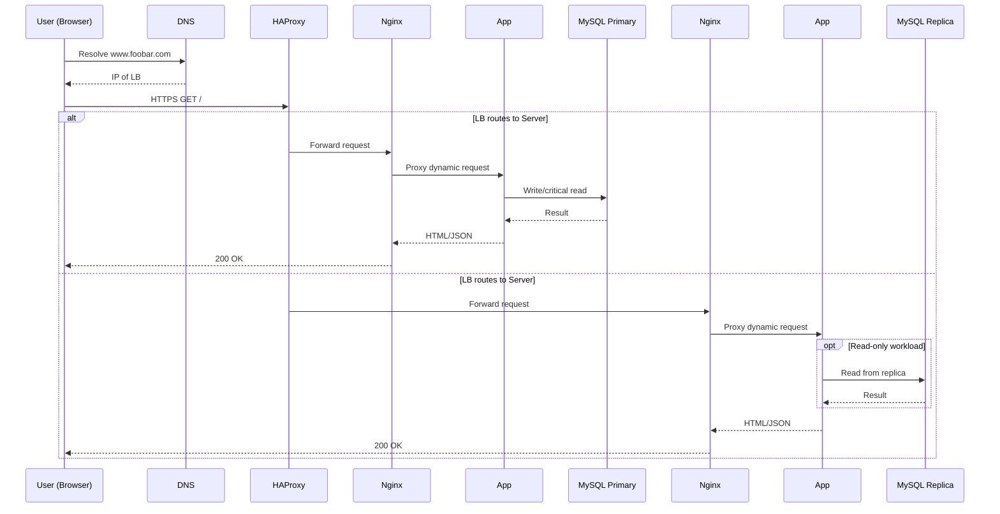

# 1. Distributed Web Infrastructure

A three-server web infrastructure for **www.foobar.com** with:
- 1 load balancer (HAProxy)
- 2 backend servers (each: Nginx, application server, codebase, MySQL with Primary/Replica topology)

---

## 🌐 Diagram – Flowchart (Mermaid)

---

## 📄 Explanation

### 1) User Request and DNS Resolution
1. The user opens a browser and types `www.foobar.com`.
2. The browser asks the DNS to resolve the domain name into an IP address.
3. The DNS replies with the IP address of the **load balancer**.
4. The browser sends an HTTPS/HTTP request to the load balancer.

---

### 2) Load Balancer (HAProxy)
1. The load balancer receives the request.
2. It uses a **distribution algorithm** (for example, Round-Robin) to choose a backend server.
3. It forwards the request to one of the two Nginx web servers.

---

### 3) Backend Servers
1. **Nginx (web server):**
   - Serves static files (HTML, CSS, JS) directly.
   - For dynamic requests, it forwards them to the application server.
2. **Application server:**
   - Runs the business logic (your code).
   - If data is needed, it queries the database.
3. **MySQL Primary–Replica:**
   - The **Primary** database handles all **writes** and critical reads.
   - The **Replica** receives asynchronous updates from the Primary and can be used for **read-only queries**.

---

### 4) Why We Added Each Component
- **Load balancer:** Distributes traffic between the two servers to increase availability and reliability.
- **Two servers:** Provide redundancy — if one server fails, the other continues to serve users.
- **Primary–Replica database setup:** Improves read performance by offloading SELECT queries to the replica.

---

### 5) Infrastructure Issues
- **Single Point of Failure (SPOF):**
  - The load balancer is a SPOF — if it goes down, no traffic can reach the servers.
  - The MySQL Primary is also a SPOF — if it fails, no writes are possible until manual failover.
- **Security issues:** No firewall and no HTTPS termination are configured.
- **No monitoring:** There is no way to detect failures or measure performance.

---
