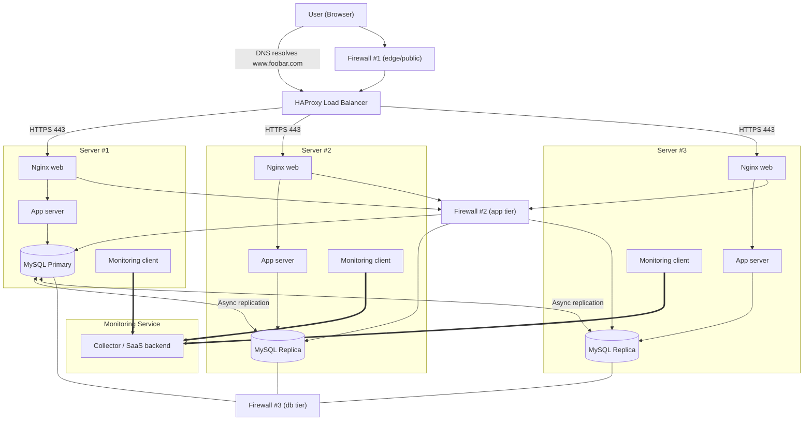
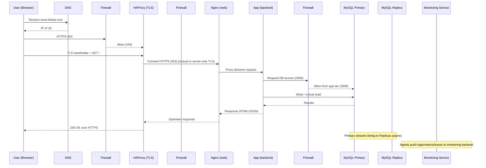

# 2. Secured and Monitored Web Infrastructure

A three-server web infrastructure for **www.foobar.com** that is **secured**, serves **encrypted traffic (HTTPS)**, and is **monitored**.

---

## 🌐 Diagram – Flowchart

---

## 📄 Explanation

### 1) User Request, HTTPS, and Firewalls
1. The user opens a browser and types `www.foobar.com`.
2. The browser asks the DNS to resolve the domain name into an IP address.
3. The DNS replies with the IP address of the **load balancer**.
4. The browser establishes an **HTTPS connection** with the load balancer using an **SSL certificate**.
5. **Firewall #1 (edge firewall)** allows only port 443 (HTTPS) and blocks everything else.
6. The load balancer forwards the request to one of the web servers over HTTPS.
7. **Firewall #2 (application tier firewall)** only allows traffic from the web servers to the application servers.
8. **Firewall #3 (database firewall)** only allows database connections from the application servers.

---

### 2) Backend Servers
1. **Nginx (web server):**
   - Terminates HTTPS (if TLS is end-to-end, Nginx also uses HTTPS internally).
   - Serves static files and forwards dynamic requests to the application server.
2. **Application server:**
   - Runs the business logic (code).
   - If data is required, it queries the database.
3. **MySQL Primary–Replica cluster:**
   - The **Primary** database handles all writes.
   - The **Replicas** receive asynchronous updates from the Primary and can serve read-only queries.

---

### 3) HTTPS and SSL Certificate
- **Why use HTTPS:**
  - Encrypts traffic to protect sensitive information.
  - Guarantees integrity and prevents tampering.
  - Authenticates the server identity via the SSL certificate.

---

### 4) Firewalls — Purpose
- Firewalls enforce **network segmentation** and the **principle of least privilege**:
  - **Firewall #1:** Only allows internet → load balancer traffic on ports 80/443.
  - **Firewall #2:** Only allows web servers to reach the application servers.
  - **Firewall #3:** Only allows app servers to connect to the database (port 3306).

---

### 5) Monitoring
- **Why monitoring is important:** Detects outages, performance issues, and security anomalies.
- **How monitoring works:** A monitoring client runs on each server and sends logs, metrics, and traces to a central monitoring system.
- **To monitor QPS (Queries Per Second):**
  1. Enable Nginx or HAProxy metrics.
  2. Collect request counts regularly.
  3. Compute QPS and display it on dashboards.
  4. Configure alerts when QPS exceeds capacity.

---

### 6) Why We Added Each Component
- **3 Firewalls:** Add security between public, application, and database layers.
- **SSL certificate:** Enables HTTPS to secure user traffic.
- **Monitoring clients:** Provide visibility into server health and performance.

---

### 7) Infrastructure Issues
- **SSL terminated only at the load balancer:**
  - Traffic between load balancer and backend servers is unencrypted if no end-to-end TLS is used.
- **Only one MySQL Primary:**
  - This is a Single Point of Failure (SPOF) for writes. If it fails, no writes are possible until failover.
- **Servers with identical components:**
  - Increases risk: a misconfiguration or attack on one server could affect all.
  - Encourages storing state locally (sessions, files), making scaling and failover harder.

---
