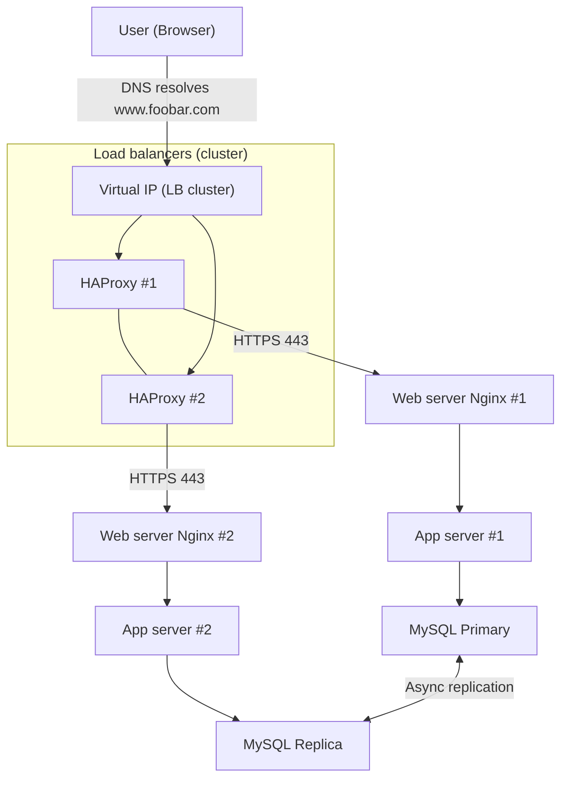

# 3. Scale Up

Scale up the web infrastructure for **www.foobar.com** by removing single points of failure and **splitting components** onto dedicated servers.

---

## 🌐 Diagram – Flowchart

---

## 📄 Explanation

### 1) What Changes in This Scale-Up
1. A **new server** is added to increase capacity and improve redundancy.
2. A **second load balancer** is added and configured in a **cluster** with the first one, using a **virtual IP (VIP)** to remove the load balancer single point of failure.
3. **Components are split by tier** so that each type of service has its own dedicated server(s):
   - **Web servers:** Nginx only, serving static assets and reverse-proxying dynamic requests.
   - **Application servers:** Running the business logic (your code).
   - **Database servers:** A MySQL Primary for writes and a Replica for read-only queries.

---

### 2) Why Each Additional Element Is Added
- **Second HAProxy (cluster with VIP):**
  - Prevents downtime if one load balancer fails.
  - Allows maintenance on one LB while the other keeps serving users.
- **Dedicated Web Servers:**
  - Isolate HTTP/TLS handling from application logic.
  - Easier to scale horizontally based on incoming traffic.
- **Dedicated Application Servers:**
  - Run CPU- and memory-intensive business logic separately from web servers.
  - Can scale independently from the web tier by adding more app nodes.
- **Dedicated Database Servers:**
  - Primary handles writes, Replica handles read-only queries.
  - Improves performance and availability, with a clear failover path.

---

### 3) Application Server vs Web Server
- **Web server (Nginx):**
  - Terminates HTTP/HTTPS.
  - Serves static files (HTML, CSS, JS).
  - Reverse-proxies dynamic requests to the application servers.
- **Application server:**
  - Runs the business logic and generates dynamic content.
  - Interacts with databases, caches, and other services.
  - Returns responses (HTML, JSON, etc.) to the web server.

> **In short:** Nginx is the front door (static + proxy), while the application server is the “brain” of your app.

---

### 4) Typical Request Path
1. The user sends a request to the **VIP** of the load balancer cluster.
2. One of the two load balancers receives the request and forwards it to an **Nginx web server**.
3. Nginx serves static content or forwards dynamic requests to an **application server**.
4. The application server reads/writes data to the **MySQL Primary** or **Replica**.
5. The response is sent back through Nginx → Load Balancer → User.

---
